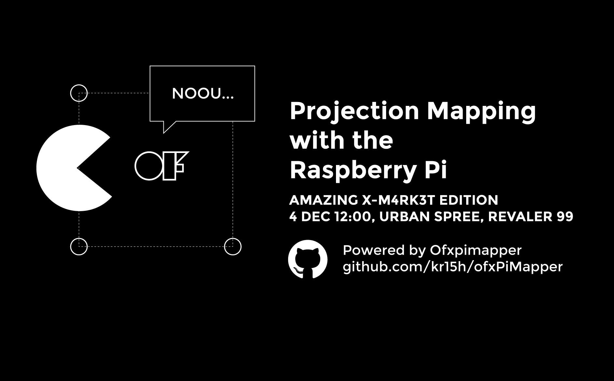
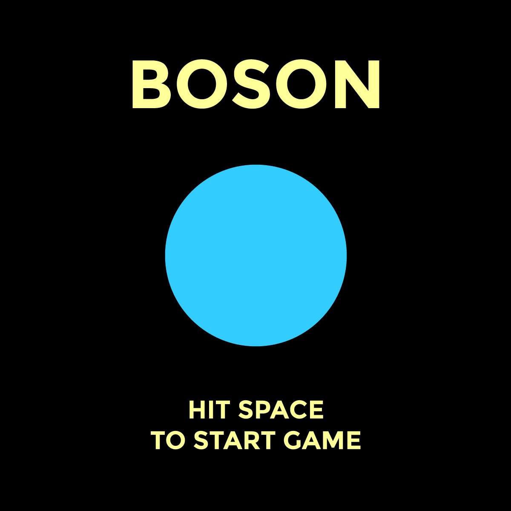
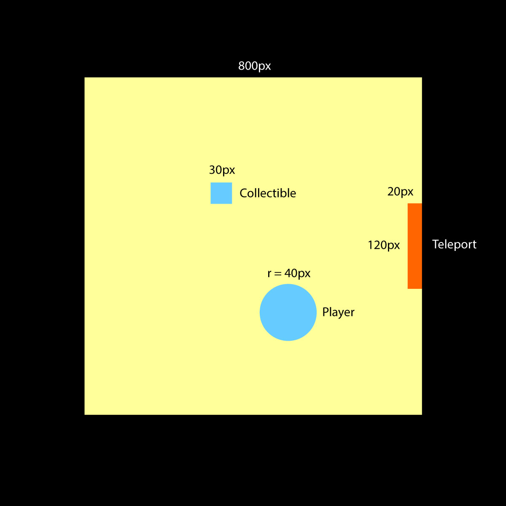
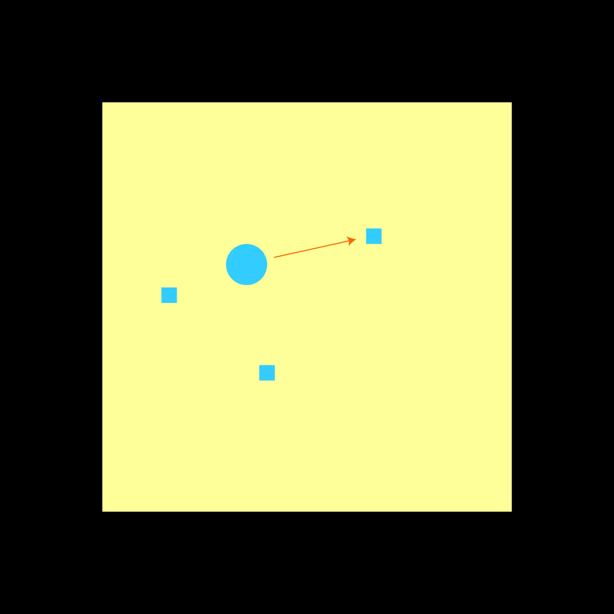
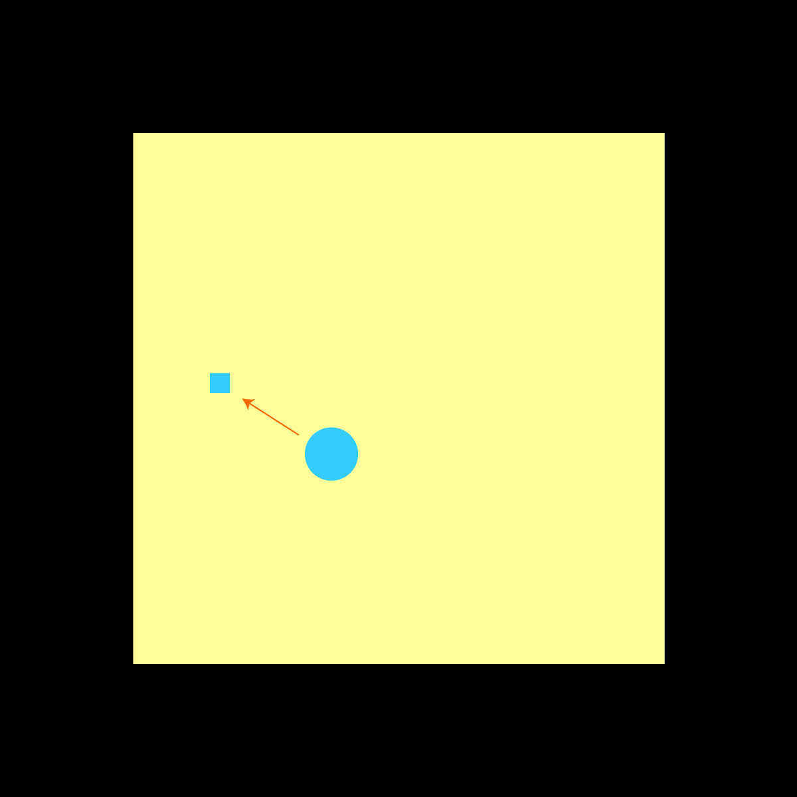
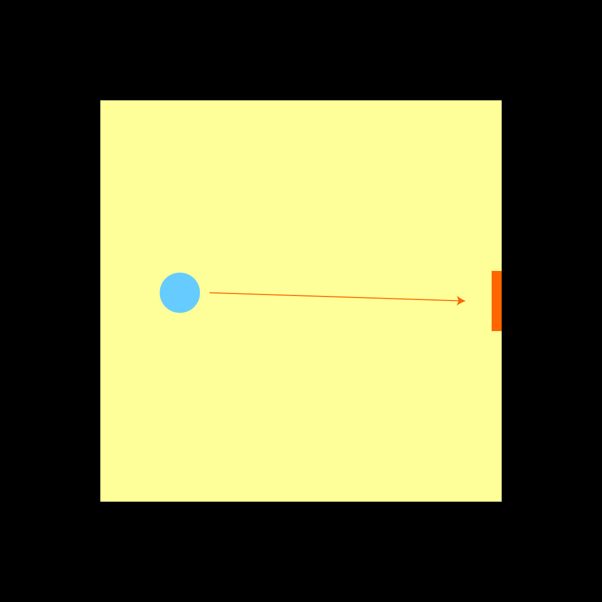
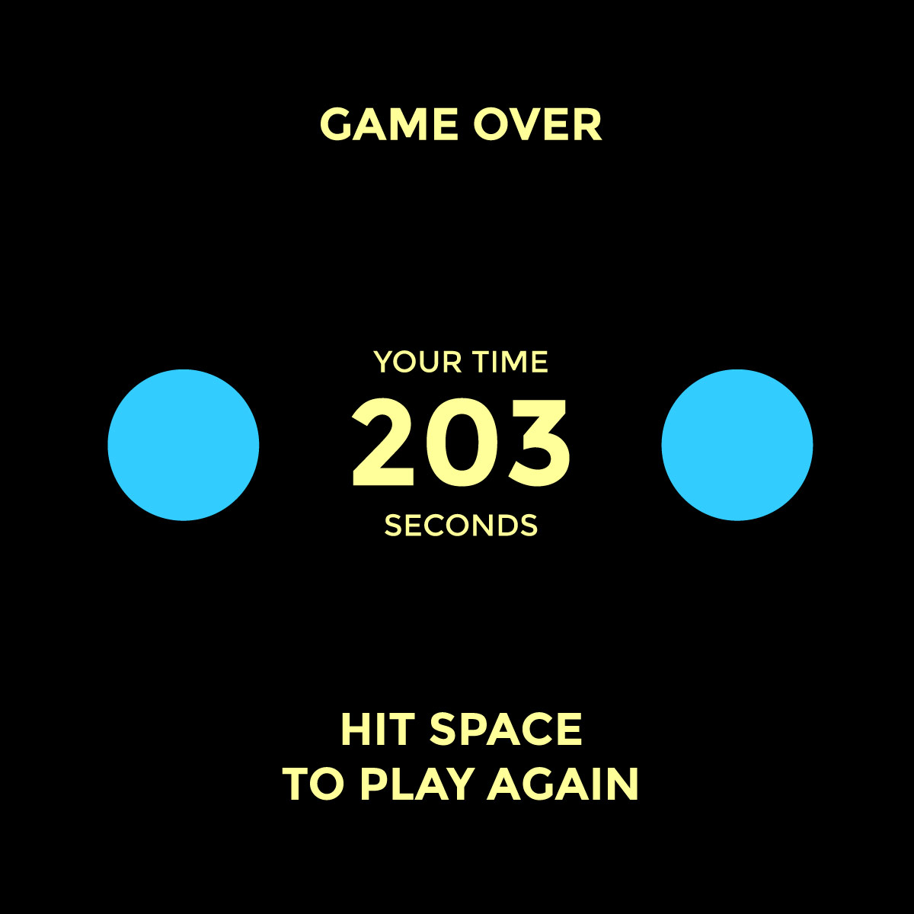

slidenumbers: true
autoscale: true
footer: © Krisjanis Rijnieks 2016



---

# WiFi

SSID: Urban Spree Guest
PASS: urbanspree

Welcom

---

# Today

- Build a game
- Configure Raspberry Pi
- Projection Mapping

---

# Introduction

Hello. How are you? Please introduce yourself.

- What is your name?
- What do you do?
- Why are you here?

---

# Krisjanis Rijnieks

- From Riga, Latvia
- MA in New Media / Media Lab Helsinki
- Member of Pixelache Helsinki
- Developer of ofxPiMapper
- Author of Cinder–Begin Creative Coding

---

# My Projects

Projects range in complexity and usually include a combination of the following.

- Creative coding
- Projection mapping
- Digital fabrication

---


---


---


---

# Overview

- Understanding the game
- Creating the game in openFrameworks
- Burning SD card for the Raspberry Pi
- Compiling on the Raspberry Pi
- Projection mapping with the Pi

---

# Software Checklist

- OpenFrameworks
  openframeworks.cc
- FileZilla
  filezilla-project.org
- Git (optional)
  git-scm.com

---

# The Game

---



---

# Story

There are times when bosons are hungry. They travel great distances in order to find food and exit reality.

---

# Boson... What?

Boson. A subatomic particle, such as a photon, which has zero or integral spin and follows the statistical description given by S. N. Bose and Einstein. Compare with fermion.

---

# Actors

- Player
- Collectibles
- Teleport

---



---

# Mechanics

- **Player** collects **Collectibles**
- **Teleport** appears
- **Player** exits reality through **Teleport**
- Time is being measured
- Game over

---

# Step 01



---

# Step 02



---

# Step 03



---



---

# Download Source Code

You can find it on GitHub

```
git clone http://github.com/kr15h/boson.git
```

---

# Edit Source Code

Use XCode or a text editor to add features. Make sure that every next step you make compiles.

- Adding a Teleport
- Adding some sounds
- Some images

^ I wonder why XCode has a X in front. It might be related to XMas.

---

# Burning SD Card

Please follow the link to access the instructions page.

**http://ej.uz/sd-card-burning-guides**

---

# SSH

```
ssh pi@192.168.0.N
```

Username: pi
Password: raspberry

---

# Command Line 101

```
pwd             Print working directory
cd /my/dir      Change directory to /my/dir
cd ..           Change directory one level up
ls              List directory
ls -al          List directory with hidden files as a list
mkdir /my/dir   Make directory /my/dir
touch file.txt  Create empty file.txt
cat file.txt    Show file contents (best for small files)
less file.txt   Show file contents (good for longer text)   
```

---

# Upload Source Code

- With FileZilla
  user: pi
  pass: raspberry
  port: 22
- With Git
  git clone http://github.com/kr15h/boson.git

---

# Compile and Run


```
cd openFrameworks/apps/myApps/boson
make
./bin/boson
```

---

# Shortcuts

You can find an ever updating version of keyboard shortcuts on the ofxPiMapper GitHub repository.

**https://github.com/kr15h/ofxPiMapper**

---

# Next Workshop

- 28/29 Jan 2017
- Fab Lab Berlin
- Follow Ofxpimapper on Facebook

## Thank you!

http://github.com/kr15h/ofxPiMapper

